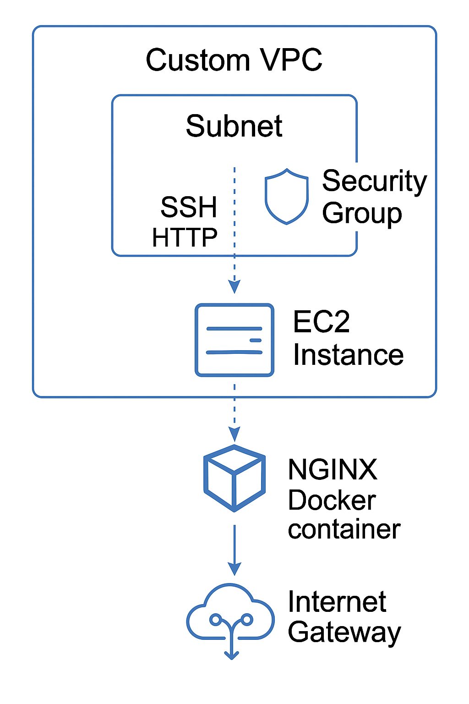

# Terraform AWS EC2 Deployment

This project demonstrates a practical use case of deploying infrastructure on AWS using Terraform. The goal is to provision a virtual server (EC2 instance) running an NGINX Docker container, entirely within a custom network environment.



## Key Components:

- **Create Custom VPC** – Define a virtual private network to isolate AWS resources.
- **Create Custom Subnet** – Allocate a specific IP range within the VPC in one availability zone.
- **Create Route Table and Internet Gateway** – Enable internet connectivity for resources in the subnet.
- **Provision an EC2 Instance** – Launch a virtual server to host applications or services.
- **Deploy Nginx Docker Container** – Run a lightweight web server inside the EC2 using Docker.
- **Create Security Group (Firewall)** – Configure access rules to allow HTTP and SSH traffic.

This setup follows best practices by provisioning all infrastructure components from scratch, avoiding AWS default resources, and allowing for clean teardown when no longer needed.

---

## Creating VPC and Subnet:

A custom VPC and subnet are provisioned in a chosen availability zone with internet access via an Internet Gateway. Terraform variables are used to parameterize CIDR blocks, availability zone, and environment-based naming, clearly separated from default AWS components.

---

## Route Table and Internet Gateway:

Upon creating a custom VPC, AWS automatically generates a default route table and network ACL for internal traffic and subnet-level firewall rules. To enable internet connectivity, a new Internet Gateway and custom route table are provisioned using Terraform. This route table explicitly routes all outbound traffic (0.0.0.0/0) through the Internet Gateway. Tags and environment-based prefixes are applied consistently, and Terraform handles resource dependencies automatically during provisioning.

---

## Subnet Association with Route Table:

To route internet-bound traffic from our subnet, we must explicitly associate it with the custom route table that includes the Internet Gateway route. By default, subnets are associated with the main route table of the VPC, which may lack internet connectivity. Using Terraform’s `aws_route_table_association` resource, we bind the custom subnet to the correct route table, ensuring that all outbound traffic (e.g., SSH or web access) from resources like EC2 instances is properly routed via the Internet Gateway.

---

## Use Main/Default Route Table:

Instead of creating a custom route table, you can configure the default route table provided by AWS for your VPC using the `aws_default_route_table` resource. By referencing the default route table ID (available via the VPC resource), you can add a route to the Internet Gateway, enabling outbound traffic. Since subnets not explicitly associated with any route table are automatically linked to the main one, this approach simplifies configuration by eliminating the need for separate route table creation and subnet association.

---

## Security Group:

To allow SSH access (port 22) and web access to the NGINX container (port 8080) on the EC2 instance, a custom security group is created using the `aws_security_group` resource. It includes two ingress rules: one restricted to your local IP for SSH, and another open to the world for HTTP access. The egress rule allows all outbound traffic to enable package installations and Docker image pulls. To keep IP-specific variables (like your local IP) secure and configurable, these are stored in a local `terraform.tfvars` file excluded from version control. Terraform also supports using the default security group instead of creating a new one, if preferred.

---

## Amazon Machine Image (AMI) for EC2:

Now we'll configure an AWS EC2 instance using Terraform, started from setting up a VPC, subnet, Internet Gateway, and security group with open ports 22 and 80. We'll dynamically select the latest Amazon Linux AMI (Amazon Machine Image) using data sources and filters, rather than hardcoding the AMI ID, ensuring the configuration remains up-to-date across regions and image updates. We also use filters for attributes like image name and virtualization type, and how to validate the selected AMI with Terraform outputs before deploying the instance.

---

## Create EC2 Instance:

We configure an AWS EC2 instance using Terraform, focusing on best practices such as parameterizing the instance type and availability zone, explicitly assigning the instance to a custom VPC, subnet, and security group, and securely managing SSH key pairs for access. It covers associating a public IP for connectivity, handling key permissions for secure SSH access, and demonstrates the full workflow from configuration to instance creation, verification, and secure login, ensuring a reproducible and secure infrastructure setup.

---

## Automate SSH Key Pair:

We also automate the creation and management of SSH key pairs for AWS EC2 instances, eliminating manual steps such as generating keys, copying files, and configuring permissions. By defining the key pair as a Terraform resource and allowing users to specify their public key or its file path as a variable, the setup becomes reusable and adaptable for different team members. This approach ensures infrastructure is fully codified, simplifies environment replication, and reduces the risk of manual errors or forgotten resources during cleanup, aligning with best practices for infrastructure as code.

---

## Run Entrypoint Script to Start Docker Container:

We automate AWS EC2 instance provisioning with user data scripts that install Docker, start the service, add the default user to the Docker group, and launch an Nginx container on port 80. This fully automates server setup and container deployment, ensuring a ready-to-use environment immediately after instance creation.

---

## Extract to Shell Script:

Instead of running entrypoint script, we'll configure Terraform to run the external shell scripts in Terraform’s user data for cleaner infrastructure provisioning. While Terraform automates instance creation and initial setup, it’s limited in managing ongoing server configuration and application deployment. For those tasks, complementary tools like Ansible or Puppet are recommended to handle application-level automation beyond Terraform’s scope.

---

## Example Configuration:

### `terraform.tfvars`

```hcl
vpc_cidr_block = "10.0.0.0/16"           # CIDR block for the VPC, defines the IP address range for the network
subnet_cidr_block = "10.0.10.0/24"       # CIDR block for the subnet within the VPC
avail_zone = "ap-northeast-2c"            # Availability zone where resources will be deployed (Seoul region)
env_prefix = "dev"                        # Environment prefix used for naming/tagging resources (e.g., dev, prod)
my_ip = "110.93.205.18/32"                # Your public IP address with mask, used for restricting SSH access
instance_type = "t2.micro"                 # EC2 instance type specifying hardware configuration
public_key_location = "/home/machine/.ssh/id_rsa.pub"  # File path to your public SSH key for EC2 access
````

### `main.tf`

```hcl
# Define the AWS provider and region for infrastructure provisioning
provider "aws" {
  region = "eu-central-1"  # Specify AWS region (e.g., EU Central 1)
}

# Declare Terraform variables for VPC, subnet, availability zone, instance type, etc.
variable vpc_cidr_block {}              # CIDR block for the VPC (IP range for your VPC)
variable subnet_1_cidr_block {}         # CIDR block for subnet 1 (IP range for your subnet)
variable avail_zone {}                  # Availability zone for deploying resources (e.g., ap-northeast-2c)
variable env_prefix {}                  # Prefix for environment-specific naming (e.g., dev, prod)
variable instance_type {}               # EC2 instance type (e.g., t2.micro)
variable ssh_key {}                     # Path to your SSH public key file for EC2 access
variable my_ip {}                       # Your public IP (used to restrict SSH access)

# Data source for fetching the latest Amazon Linux AMI based on filters
data "aws_ami" "amazon-linux-image" {
  most_recent = true  # Ensure the most recent AMI is selected
  owners      = ["amazon"]  # Only include AMIs owned by Amazon

  # Filter AMIs by name (matching Amazon Linux 2 AMI)
  filter {
    name   = "name"
    values = ["amzn2-ami-hvm-*-x86_64-gp2"]  # AMI name pattern for Amazon Linux 2
  }

  # Filter AMIs by virtualization type (HVM)
  filter {
    name   = "virtualization-type"
    values = ["hvm"]  # Ensure the AMI is HVM type (Hardware Virtual Machine)
  }
}

# Output the AMI ID for reference
output "ami_id" {
  value = data.aws_ami.amazon-linux-image.id  # Output the selected AMI ID
}

# Create a custom VPC (Virtual Private Cloud) for the application
resource "aws_vpc" "myapp-vpc" {
  cidr_block = var.vpc_cidr_block  # Define the VPC CIDR block
  tags = {
    Name = "${var.env_prefix}-vpc"  # Tag with environment prefix for identification
  }
}

# Create a subnet within the VPC
resource "aws_subnet" "myapp-subnet-1" {
  vpc_id = aws_vpc.myapp-vpc.id  # Associate subnet with the created VPC
  cidr_block = var.subnet_1_cidr_block  # Define the subnet CIDR block
  availability_zone = var.avail_zone  # Define the availability zone for the subnet
  tags = {
    Name = "${var.env_prefix}-subnet-1"  # Tag with environment prefix for identification
  }
}

# Create a security group to control access to the EC2 instances
resource "aws_security_group" "myapp-sg" {
  name   = "myapp-sg"  # Security group name
  vpc_id = aws_vpc.myapp-vpc.id  # Associate security group with the created VPC

  # Ingress rule to allow SSH access (restricted to your IP)
  ingress {
    from_port   = 22  # Allow SSH on port 22
    to_port     = 22
    protocol    = "tcp"
    cidr_blocks = [var.my_ip]  # Restrict access to your IP address
  }

  # Ingress rule to allow HTTP access to the NGINX container (port 8080)
  ingress {
    from_port   = 8080  # Allow HTTP on port 8080
    to_port     = 8080
    protocol    = "tcp"
    cidr_blocks = ["0.0.0.0/0"]  # Open to the world (public access)
  }

  # Egress rule to allow all outbound traffic
  egress {
    from_port       = 0
    to_port         = 0
    protocol        = "-1"  # Allow all protocols
    cidr_blocks     = ["0.0.0.0/0"]  # Allow all outbound traffic
    prefix_list_ids = []  # No specific prefix list used
  }

  tags = {
    Name = "${var.env_prefix}-sg"  # Tag with environment prefix for identification
  }
}

# Create an internet gateway for enabling internet access
resource "aws_internet_gateway" "myapp-igw" {
  vpc_id = aws_vpc.myapp-vpc.id  # Attach the gateway to the VPC

  tags = {
    Name = "${var.env_prefix}-internet-gateway"  # Tag with environment prefix for identification
  }
}

# Create a custom route table for the VPC
resource "aws_route_table" "myapp-route-table" {
  vpc_id = aws_vpc.myapp-vpc.id  # Associate route table with the VPC

  # Define a route for all outbound traffic to go through the internet gateway
  route {
    cidr_block = "0.0.0.0/0"  # Route all outbound traffic
    gateway_id = aws_internet_gateway.myapp-igw.id  # Route through the internet gateway
  }

  tags = {
    Name = "${var.env_prefix}-route-table"  # Tag with environment prefix for identification
  }
}

# Associate the subnet with the route table
resource "aws_route_table_association" "a-rtb-subnet" {
  subnet_id      = aws_subnet.myapp-subnet-1.id  # Associate subnet with the route table
  route_table_id = aws_route_table.myapp-route-table.id  # Use the custom route table
}

# Define an SSH key pair resource for EC2 access
resource "aws_key_pair" "ssh-key" {
  key_name   = "myapp-key"  # Name of the SSH key pair
  public_key = file(var.ssh_key)  # Use the public SSH key specified in terraform.tfvars
}

# Output the public IP address of the EC2 instance
output "server-ip" {
  value = aws_instance.myapp-server.public_ip  # Output the public IP of the first EC2 instance
}

# Provision the first EC2 instance
resource "aws_instance" "myapp-server" {
  ami                         = data.aws_ami.amazon-linux-image.id  # Use the selected Amazon Linux AMI
  instance_type               = var.instance_type  # Define the instance type (e.g., t2.micro)
  key_name                    = "myapp-key"  # Use the SSH key for access
  associate_public_ip_address = true  # Ensure the instance gets a public IP address
  subnet_id                   = aws_subnet.myapp-subnet-1.id  # Assign instance to the subnet
  vpc_security_group_ids      = [aws_security_group.myapp-sg.id]  # Attach the security group
  availability_zone           = var.avail_zone  # Define the availability zone for the instance

  tags = {
    Name = "${var.env_prefix}-server"  # Tag with environment prefix for identification
  }

  # User data script to install Docker and run an NGINX container
  user_data = <<EOF
                 #!/bin/bash
                 apt-get update && apt-get install -y docker-ce  # Install Docker
                 systemctl start docker  # Start Docker service
                 usermod -aG docker ec2-user  # Add user to Docker group
                 docker run -p 8080:8080 nginx  # Run NGINX container on port 8080
              EOF
}

# Provision the second EC2 instance
resource "aws_instance" "myapp-server-two" {
  ami                         = data.aws_ami.amazon-linux-image.id  # Use the selected Amazon Linux AMI
  instance_type               = var.instance_type  # Define the instance type
  key_name                    = "myapp-key"  # Use the SSH key for access
  associate_public_ip_address = true  # Ensure the instance gets a public IP address
  subnet_id                   = aws_subnet.myapp-subnet-1.id  # Assign instance to the subnet
  vpc_security_group_ids      = [aws_security_group.myapp-sg.id]  # Attach the security group
  availability_zone           = var.avail_zone  # Define the availability zone for the instance

  tags = {
    Name = "${var.env_prefix}-server-two"  # Tag with environment prefix for identification
  }

  # User data script to install Docker and run an NGINX container
  user_data = <<EOF
                 #!/bin/bash
                 apt-get update && apt-get install -y docker-ce  # Install Docker
                 systemctl start docker  # Start Docker service
                 usermod -aG docker ec2-user  # Add user to Docker group
                 docker run -p 8080:8080 nginx  # Run NGINX container on port 8080
              EOF
}
```

### Initialize

```bash
terraform init
```

### Preview Terraform Actions

```bash
terraform plan
```

### Apply Configuration with Variables

```bash
terraform apply -var-file terraform-dev.tfvars
```

### Destroy a Single Resource

```bash
terraform destroy -target aws_vpc.myapp-vpc
```

### Destroy Everything from tf Files

```bash
terraform destroy
```

### Show Resources and Components from Current State

```bash
terraform state list
```

### Show Current State of a Specific Resource/Data

```bash
terraform state show aws_vpc.myapp-vpc
```

### Set Availability Zone as Custom tf Environment Variable - Before Apply

```bash
export TF_VAR_avail_zone="eu-west-3a"
```

---

## License

This project


is licensed under the MIT License - see the [LICENSE](LICENSE) file for details.
